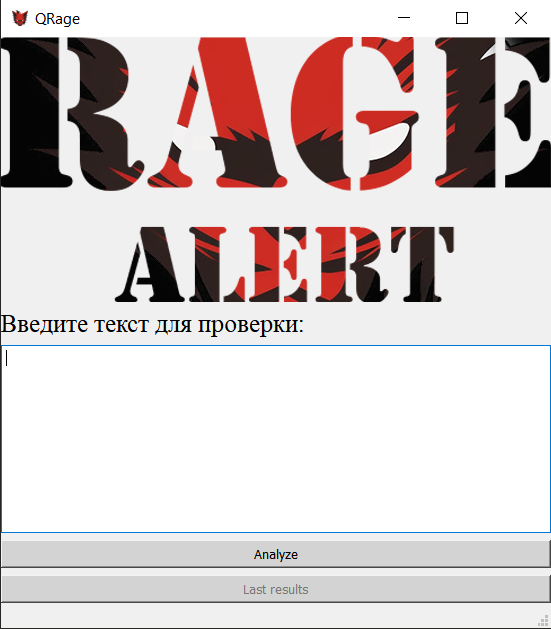
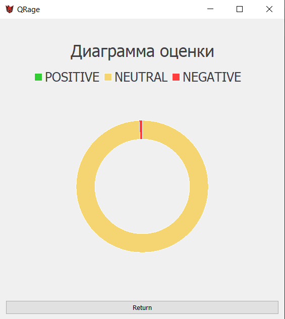
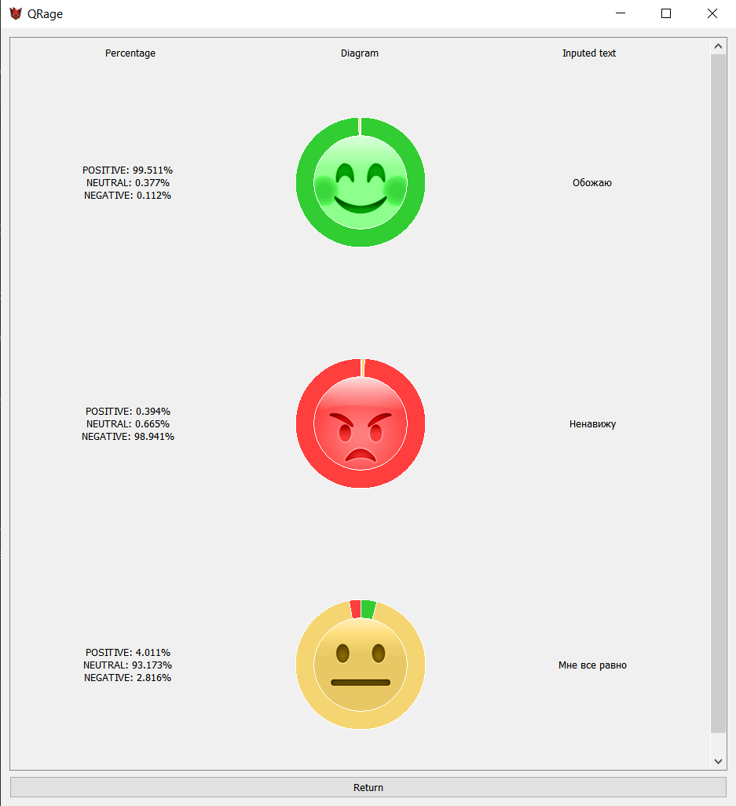

# Проект по дисциплине "Технология разработки программного обеспечения"
Тема: "Разработка приложения с графическим интерфейсом, анализирующего уровень агрессии поста интернет-пользователя"

## Проект задействует:
 - Модель SentimentModel для анализа введенного текста
 - Фреймворк Qt для разработки кроссплатформенного программного обеспечения на ЯП C++, выполненный в виде расширения PyQt5 для ЯП Python
 - Базу данных PostgreSQL
 - Docker
  
При открытии интерфейса пользователь может ввести свой текст в окно ввода и, нажав на кнопку "Analyze", проанализировать свой текст на уровень агрессии,
после чего результат анализа его текста отобразится в виде кольцевой диаграммы. После первого введенного текста, пользователь может посмотреть результаты
всех своих проверок, нажав на кнопку "Last results".

## Скриншоты
 

  
  
  
 

 
 ## Видео процесса использования
 

https://github.com/AmberDanie/trpp_project_py/assets/91751423/51c13e73-33e5-428d-8b62-66bc03f075f8

## Участники проекта

* Даниил Горбачев
  + https://github.com/AmberDanie
  + https://github.com/AmberCreating
* Максим Логвинов
  + https://github.com/f-kyoub-h
* Дмитрий Савелко
  + https://github.com/ditengm
